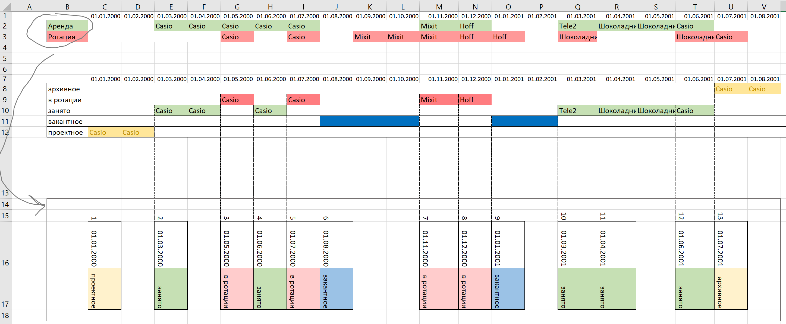
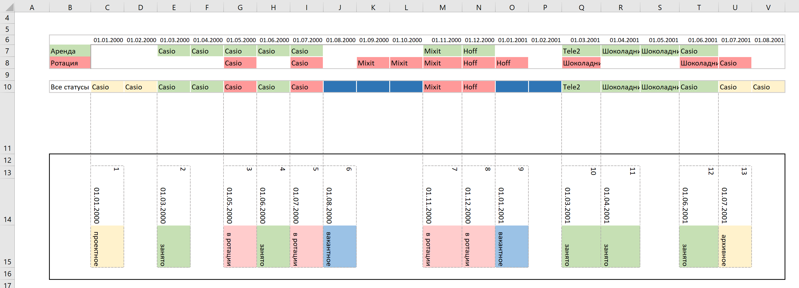

# История аренды помещения



Определения:
```text
billing_start - дата начала аренды (финансовый учет)

billing_end - дата окончания аренды (финансовый учет)

"В ротации" - статус помещения в ротационной системе

"Не в ротации" - статус выхода из ротации
```

Алгоритм расчета периода ротации:
```text
Для каждого помещения:
1. Период ротации начинается с МАКСИМУМА из:
   - Дата статуса "В ротации" 
   - Дата billing_start
   
2. Период ротации заканчивается МИНИМУМОМ из:
   - Дата ближайшего статуса "Не в ротации" ПОСЛЕ начала ротации
   - Дата billing_end
   
3. Если статус "Не в ротации" отсутствует, период заканчивается billing_end
```


# ETL Пайплайн для аналитики Помещений


Проект представляет собой ETL пайплайн для сбора,
обработки и анализа данных по истории помещений, ответственным лицам и планированию.

## 📊 Назначение проекта

Система предназначена для автоматизации процессов:
- Сбора исторических данных по помещениям
- Отслеживания ответственных лиц
- Сравнения плановых и фактических показателей
- Формирования аналитических витрин для BI-систем

## 🏗️ Архитектура системы

### Источники данных
- **CRM система** - данные об ответственных
- **ERP система (1C)** - фактические показатели
- **SQL Server** - планирование финансовых моделей

### Компоненты ETL пайплайна

Источники → Извлечение → Трансформация → BI Витрина


## 📁 Структура проекта

```
universal-etl-pipeline/
├── config/ # Конфигурации
├── src/ # Исходный код
│ ├── api/ # Интеграция с API
│ ├── database/ # Работа с БД
│ ├── sql/ 
│ ├── etl/ # ETL процессы
│ └── utils/ # Вспомогательные функции
├── data/ # Данные (локально)
├── tests/ # Тесты
├── docs/ # Документация
└── logs/ # Логи выполнения
```