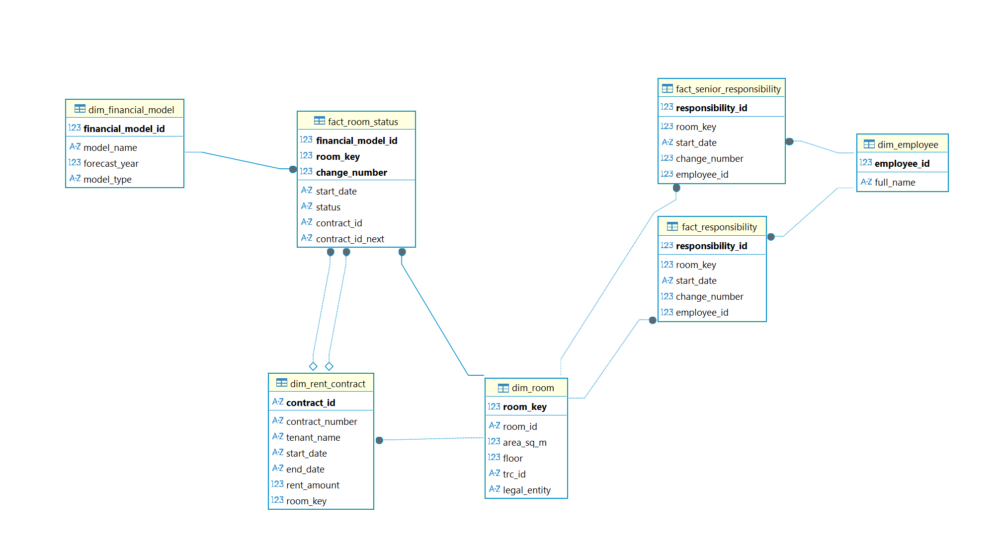

# Модель данных торгового центра (Схема "созвездие")



## Таблицы измерений (Dimensions)

### dim_employee
```sql
employee_id INTEGER PRIMARY KEY
full_name TEXT NOT NULL
```

### dim_financial_model
```sql
financial_model_id INTEGER PRIMARY KEY
model_name TEXT NOT NULL
forecast_year INTEGER
model_type TEXT NOT NULL
```

### dim_room
```sql
room_key INTEGER PRIMARY KEY AUTOINCREMENT
room_id TEXT NOT NULL
area_sq_m REAL NOT NULL 
floor INTEGER NOT NULL
trc_id TEXT NOT NULL
legal_entity TEXT NOT NULL
```

### dim_rent_contract
```sql
contract_id TEXT PRIMARY KEY
contract_number TEXT NOT NULL
tenant_name TEXT NOT NULL
start_date DATE NOT NULL
end_date DATE NOT NULL
rent_amount REAL NOT NULL
room_key INTEGER NOT NULL
FOREIGN KEY (room_key) REFERENCES dim_room(room_key)
```

## Таблицы фактов (Facts)

### fact_responsibility
```sql
responsibility_id INTEGER PRIMARY KEY
room_key INTEGER NOT NULL
start_date DATE NOT NULL
change_number INTEGER NOT NULL
employee_id INTEGER NOT NULL
FOREIGN KEY (room_key) REFERENCES dim_room(room_key)
FOREIGN KEY (employee_id) REFERENCES dim_employee(employee_id)
```

### fact_senior_responsibility
```sql
responsibility_id INTEGER PRIMARY KEY
room_key INTEGER NOT NULL
start_date DATE NOT NULL
change_number INTEGER NOT NULL
employee_id INTEGER NOT NULL
FOREIGN KEY (room_key) REFERENCES dim_room(room_key)
FOREIGN KEY (employee_id) REFERENCES dim_employee(employee_id)
```

### fact_room_status
```sql
financial_model_id INTEGER NOT NULL
room_key INTEGER NOT NULL
change_number INTEGER NOT NULL
start_date DATE NOT NULL
status TEXT NOT NULL
contract_id TEXT
contract_id_next TEXT
PRIMARY KEY (financial_model_id, room_key, change_number)
FOREIGN KEY (financial_model_id) REFERENCES dim_financial_model(financial_model_id)
FOREIGN KEY (room_key) REFERENCES dim_room(room_key)
FOREIGN KEY (contract_id) REFERENCES dim_rent_contract(contract_id)
FOREIGN KEY (contract_id_next) REFERENCES dim_rent_contract(contract_id)
```